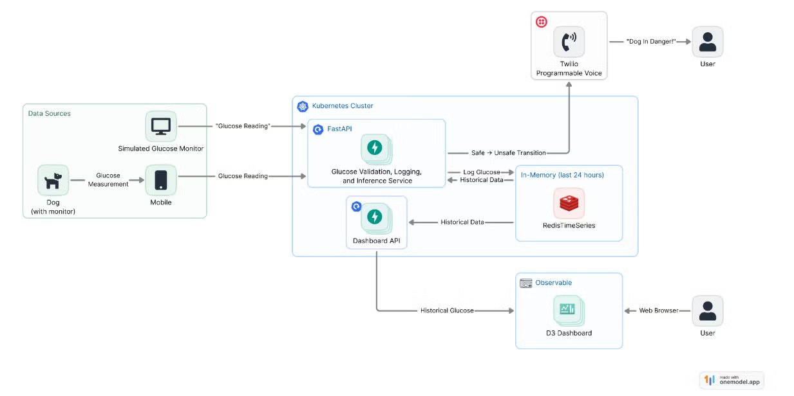

# GlycoAhead - A Canine Glucose Monitoring Platform

A cloud-native predictive monitoring platform for canine continuous glucose monitor (CGM) data.
This system ingests glucose readings, stores time-series data, performs inference, and proactively alerts owners when unsafe glucose events are predicted.

---

## Overview

The Canine Glucose Monitoring Platform provides an end-to-end infrastructure and application stack for predictive diabetic dog monitoring.

It is designed to:

* Ingest CGM readings through a REST API
* Store glucose data in RedisTimeSeries
* Run predictive inference on recent glucose history
* Detect impending hypoglycemic/hyperglycemic events
* Trigger proactive Twilio voice alerts
* Expose glucose history/query endpoints for dashboards and visualization

It is explicitly **not designed for intended for human data** and is in no way shape or form HIPAA compliant. Please do not try this. Please.

## Architecture

The current implementation is a monolithic FastAPI application backed by RedisTimeSeries for low-latency glucose storage and retrieval. It relies on external services like Twilio and Observable D3. It requires external data sources (bring your dogs own glucose monitor). The kubernetes cluster itself runs on AWS EKS, and is provisioned via Terraform.



### Core Components

* FastAPI Application (+ Redis)
* Kubernetes Manifests
* Terraform / AWS Infrastruture

### External Components

* D3 Dashboard
* Twilio Programmable Voice
* Source of Canine Glucose Data

## Repository Structure

This repository is organized into five primary components:

1. **Terraform / AWS Infrastructure** (`canine-glucose-eks/`)

```text
canine-glucose-eks
├── main.tf         # Primary infrastructure definitions
├── variables.tf    # Terraform input variables
├── outputs.tf      # Outputs consumed by build/deploy scripts
├── terraform.tf    # Terraform/provider configuration
└── deploy.sh       # Infrastructure deployment helper
```

2. **FastAPI Application** (`deployment/canineglucoseapplication/`)

```text
deployment/canineglucoseapplication/
├── src/                # FastAPI Source Code
├── model/              # Model Bundle and Inference Helper
├── tests/              # Unit and Integration Tests
├── .k8s/               # Kubernetes Manifests and Kustomize Overlays
├── dockerfile          # Instructions to Create the FastAPI image
├── build-local.sh      # Deploys to MiniKube
├── build-push.sh       # Deploys to Cloud
├── pyproject.toml      # Source Code Dependency Management
└── poetry.lock         # Source Code Dependency Management
```

3. **Demo / Utility Assets** (`demo/`)

```text
demo/ 
└── demo_upload_data.ipynb
```

4. **D3 Dashboard**

5. **ML Inference Models**

---

## Usage

### Dependencies

* Python 3.12.x
* Poetry 2.x
* Conda (recommended)
* Docker
* Redis Server 8.6 (container image)
* Twilio account / phone number
* Minikube (for local K8s)
    * Kubernetes CLI (kubectl)
* Terraform
* AWS CLI / AWS credentials (for production infra)

### Build / Setup

#### Create Python Environment

Build scripts assume the conda environment is named w210. Note, using `poetry` concurrently with `conda` is not a best practice and this will be changed in the future.

`conda create -n w210 python=3.12`

`conda activate w210`

`pip install poetry`

#### Install Python Dependencies

`cd deployment/canineglucoseapplication`

`poetry install`

### Configuration

#### Required Environment Variables

These must always be set in some form, though where depends on your current build.

| Variable             | Purpose                      |
| -------------------- | ---------------------------- |
| `OWNER_PHONE`        | Alert recipient phone number |
| `CALLER_PHONE`       | Twilio outbound phone number |
| `TWILIO_API_KEY`     | Twilio API key               |
| `TWILIO_API_SECRET`  | Twilio API secret            |
| `ENABLE_ALERT_CALLS` | Enable/disable voice alerts  |

For local builds these should be set as environment variables `envs`. 

e.g.

```bash
export OWNER_PHONE="+15555555555"
```

For deployments, rename `secrets-cgi-template.yaml` to `secrets-cgi-dev` or `secrets-cgi-prod` and populate the environment variables there.

```text
deployment/canineglucoseapplication/.k8s/overlays/dev/secrets-cgi-template.yaml
deployment/canineglucoseapplication/.k8s/overlays/prod/secrets-cgi-template.yaml
```

#### External Configuration

* Setup a Twilio account and get an API key.
* Enable AWS IAM Permissions Policies.

The current Terraform workflow assumes an AWS principal with sufficient permissions to create and manage EKS, IAM, EC2, and ECR resources.

During development, broad administrative policies were used for expedience:

* AmazonEC2FullAccess
* AmazonEKSFullAccess
* IAMFullAccess
* PowerUserAccess

These permissions are broader than necessary and should be reduced before production use.

## How to Run Locally

### Run Redis

FastAPI reads and writes from a redis database, so one must be available for it to talk to.

One could be installed locally, but a containerized deployment is easier. Use either docker or kubernentes to spin up a version of redis-stack-server, and forward the ports to the local machine.

```bash
docker run -p 6379:6379 redis/redis-stack-server:8.6
```

### Start FastAPI

```bash
poetry run uvicorn src.main:app --reload
```


### Run Local Kubernetes Version

```bash
conda activate w210
./build-local.sh
```


## Testing


### Run All Tests

```bash
poetry run pytest
```

### Test Categories

* **Unit Tests**

  * Data models
  * Formatting helpers
  * Redis IO helpers
  * Observable endpoint logic

* **Integration Tests**

  * Full FastAPI endpoint tests
  * Redis-backed storage tests
  * Ingestion/query validation

> Docker must be running for integration tests, because PyTest will spin up redis containers.

## Deployment

### Infrastructure Notes

Terraform provisions:

* EKS cluster
* Node groups
* IAM / IRSA roles
* ECR repository
* Supporting add-ons / policies

### Infrastructure Provisioning

Provision Infrastructure
```bash
cd canine-glucose-eks
terraform init
terraform apply
```

Get region and cluster name variables from tf output
```bash
aws eks --region $(terraform output -raw region) update-kubeconfig --name $(terraform output -raw cluster_name)
```

Verify cluster config
```bash
kubectl cluster-info
```

(Re)start Istio Ingress
```bash
kubectl rollout restart deployment istio-ingress -n istio-ingress
```

ECR authentication
```bash
aws ecr get-login-password --region $(terraform output -raw region) | docker login --username AWS --password-stdin $(terraform output -raw canine_glucose_ecr_url | cut -d/ -f1)
```

---

### Application Deployment to EKS

```bash
cd deployment/canineglucoseapplication
conda activate w210
./build-push.sh
```

---

## Known Limitations / Future Work

This was a rapid prototype for our capstone project at UC Berkeley's Masters In Data Science program.

Limitations

* Secrets still managed via Kubernetes manifests/templates
* No long-term persistent historical storage
* No user/device auth layer
* No model drift / performance monitoring

Planned Enhancements

* AWS Secrets Manager integration
* TimescaleDB / S3 historical storage
* Authentication / user management
* Model retraining / CI-CD pipeline
* **Improved alert debouncing / suppression logic**: Twilio calls on every unsafe prediction. So if two come in spaced a minute apart, expect two calls. You can imagine a demo streaming 15 - 150x realtime might cause an issue.

## Authors

Ainsley Bock
WooJung Kim
Ci Song

# License

Copyright © 2026 Project Contributors. All rights reserved.

This project and its contents are proprietary and confidential.
No part of this repository may be used, copied, modified, distributed, sublicensed, or incorporated into other works without the express prior written permission of the copyright holders.

Ownership and commercialization rights remain subject to any applicable contributor agreements, institutional policies, or other governing intellectual property arrangements.